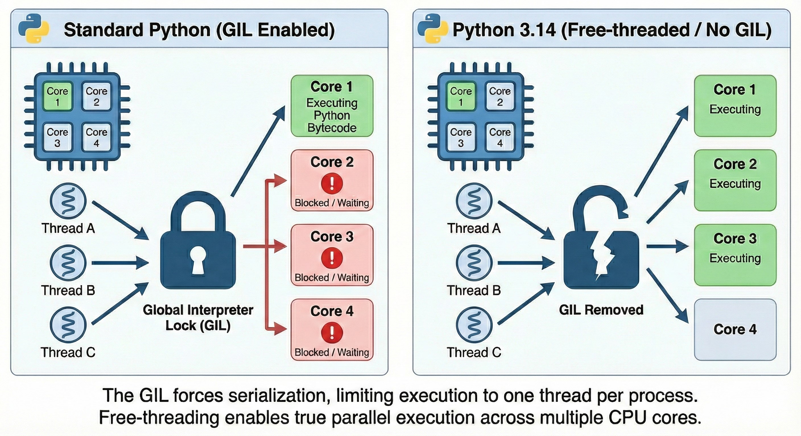
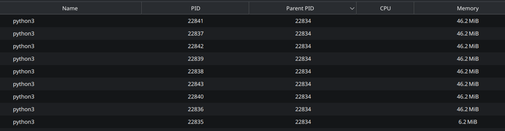
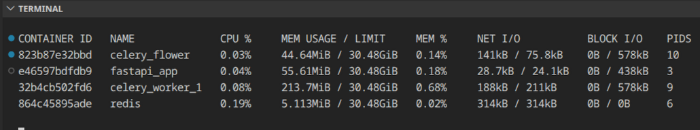
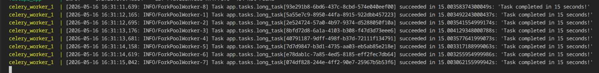
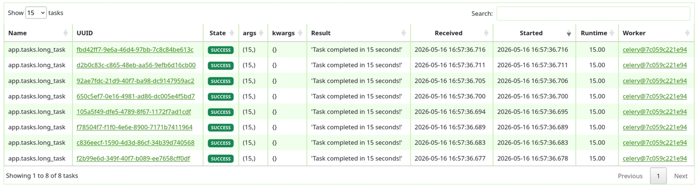
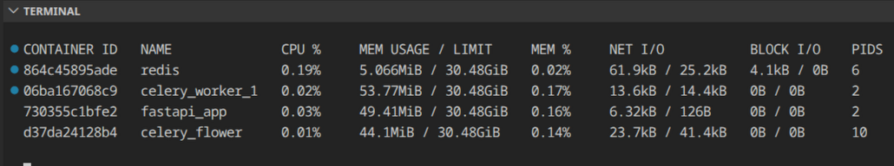
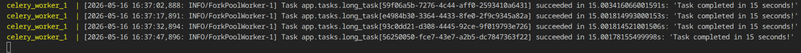
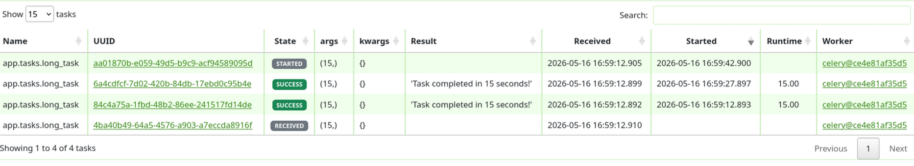

# Celery and Concurrency Testing.
This is a simple fastapi for testing different concurrency models and using celery.


## Run locally.
Following need to be running. 

1. `uv run uvicorn src.main:app`
2. `celery -A src.celery_app.celery_app worker --loglevel=info --concurrency 2`
    * If running on windows you will need to change the pool to threads since the default is pools, which windows doesn't support. `celery -A src.celery_app.celery_app worker --loglevel=info --pool threads --concurrency 2`

## Running in docker
You can simply run the docker with build to have everything run. `docker compose up --build`

---

## Sources
Most of the talking points below come from either the book [Fluent Python](https://www.amazon.com/Fluent-Python-Concise-Effective-Programming/dp/1491946008),watching David Beazley's [presentation](https://www.dabeaz.com/GIL/) on the GIL, and from reading [official python docs](https://docs.python.org/3/). This app has code that I used to help my understanding of the concepts from these sources. There are also great examples in the book you can review for free in this [git repo](https://github.com/fluentpython/example-code-2e/tree/master/19-concurrency).

## Understanding the Python Process and the GIL
When a python process is created, a system thread is generated.
Python uses system threads that are managed by the OS.
Goal is to simply low level problems.
GIL releases on IO and has a check performed every 5ms since python 3.2 to prevent locking.


---
## Python Concurrency
3 main models.
* Threading
* Multiprocessing
* Async

### Threading
Python's threading allows things to run concurrently on a single python process. The limitaiton it has is true paralleism isn't possiblem because thee gil will only allow execution of one thread at a time. Since the concurrency is mostly reliant on the GIL, this is good for I/O items since the gil releases when a thread is waiting for I/O.
#### Examples
We can try running our non block task directly or through the background task by sending multiple request at once `for i in {1..8}; do curl http://localhost:8000/non_blocking_task; done`. This endpoint creates a background task of the `sync()` function that waits 7 seconds and returns the time it ended.
Output:
```bash
End sync: 2026-05-25 09:31:00.140195
End sync: 2026-05-25 09:31:00.146314
End sync: 2026-05-25 09:31:00.151135
End sync: 2026-05-25 09:31:00.156280
End sync: 2026-05-25 09:31:00.161473
End sync: 2026-05-25 09:31:00.166277
End sync: 2026-05-25 09:31:00.171052
End sync: 2026-05-25 09:31:00.177270
```
Here we can see all request end around the same time since the work is done in concurrently with the gil releasing each thread when it's waiting.

### Multiprocessing
Creats multiple python processes that have there own interpreter and GIL. This can allow true paralleism since each proceess can be executed by a diffrent CPU core. This does have a higher startup cost and memory usage, but is the only way to run thing in parallel. This make it good for running longer, more CPU intensive processes that want more CPU time. 

#### Example
With a python web server, you can setup `workers` that use multiprocessing to handle request in Here is a photo of creating 9 workers. You will see one parent process, and 8 processes created.


This allows for task to be handle by seperate python process that each have their own GIL, allowing execution in parellel.

Here is an example of running 8 workers and running 8 task at the same time using celery.




### Asyncio 
A single thread that has an event loop. An event loop allows the use of `coroutines`. Coroutines allow for functions to prevent blocking on a thread during things like I/O using the `async` keyword to start a coroutine and `await` to pause it's execution to free the event loop. This makes it useful for handling extremtly high IO demand.

This comes with the downside of extra complexity, and can cause issues if you don't propertly handle synchronous code in your corotunes.

#### Example
This example is going to show one of the issues with async. When you start a coroutine, if you have a sync task that can be blocking, your thread will be lock since we are needing to free the thread through the event loop vs having the gil release them. This example will call a function with a sync wait, followed by an async wait. The async one will not start till the blocking on has finished. Blocking takes 15 seconds and the non blocking endpoint takes 2. Running the follow:
`curl http://localhost:8000/blocking`
`curl http://localhost:8000/non_blocking`
output:
```
INFO:     127.0.0.1:38250 - "GET /blocking HTTP/1.1" 200 OK
Start blocking: 2026-05-25 10:06:00.397845
End blocking: 2026-05-25 10:06:15.397941
INFO:     127.0.0.1:53640 - "GET /blocking HTTP/1.1" 200 OK
Start non-blocking: 2026-05-25 10:06:15.398640
End non-blocking: 2026-05-25 10:06:17.399540
INFO:     127.0.0.1:53652 - "GET /non_blocking HTTP/1.1" 200 OK
```

---
## Sync vs Async Hosting

### Uvicorn

### Gunicorn

---

## Celery Worker Examples







